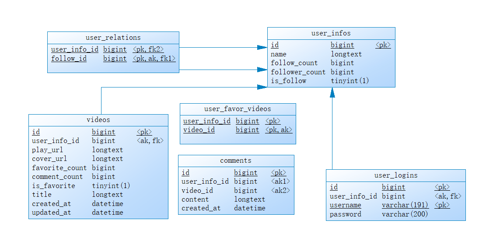

# 阳光快乐大男孩队伍项目说明

### 1、项目文件夹说明

##### 1）controller：接受前端请求，调用服务层代码进行处理，对应那个示例项目中的handler

##### 2）service：服务层， 业务主要逻辑实现

##### 3）dao：持久化层，对数据库进行操作

##### 4）config：配置文件

##### 5）public：存放上传的视频

##### 6）router：路由映射

##### 7）test：测试包

##### 8）util：工具包
### 2、数据库表说明
